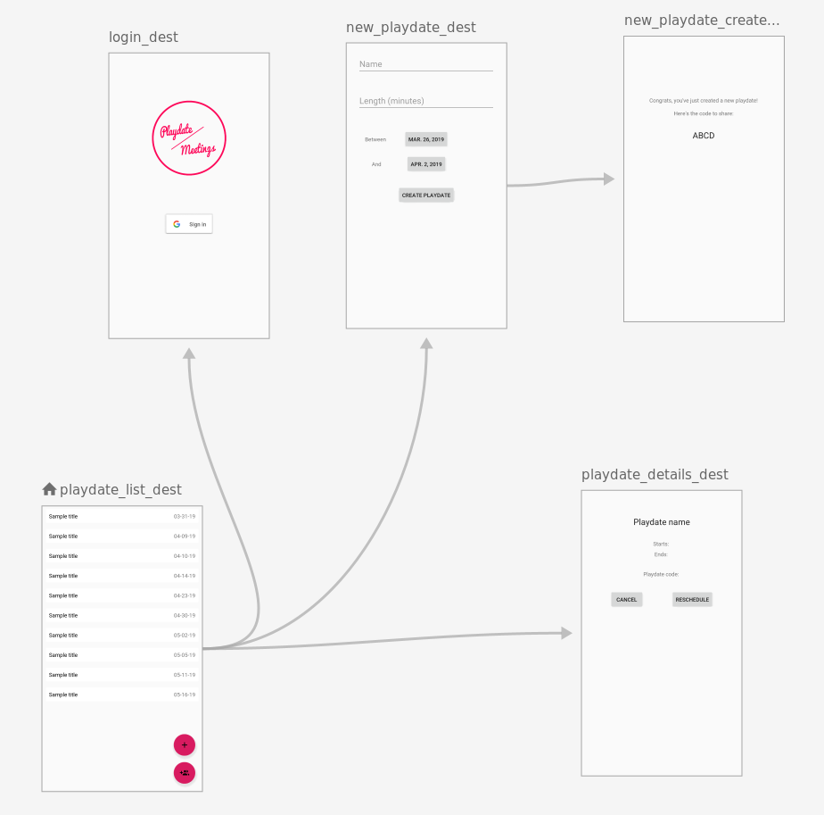
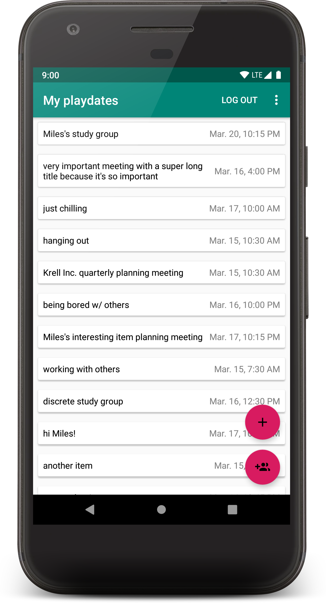
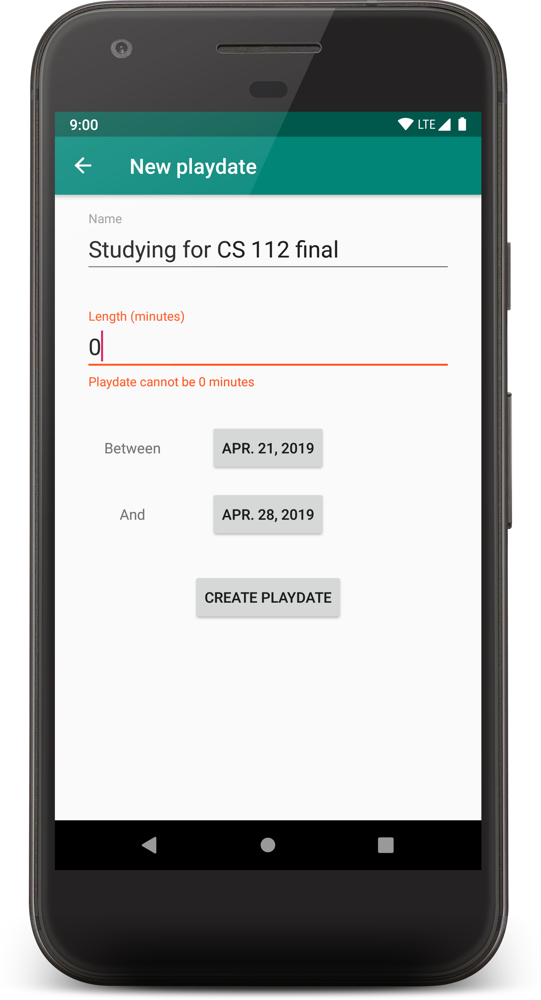
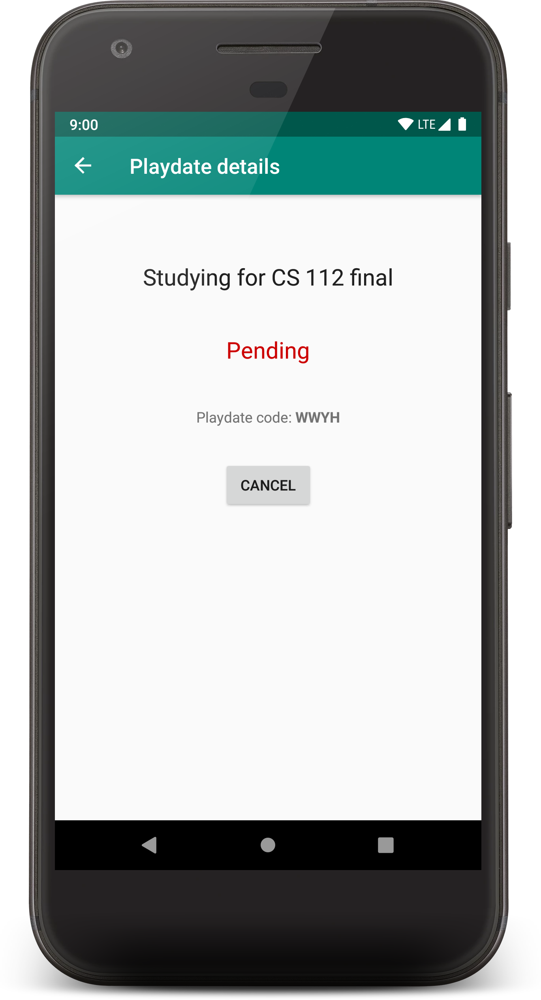
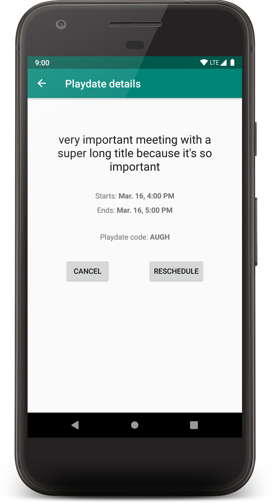

# Playdate

## Concept
Playdate is an app designed to help people schedule a common time to meet. It pulls data about when each person in the group is busy or free from their Google Calendar. Then, it shows the users when they have overlapping free time, and lets them pick a time for their meeting.

## Reality
I was working on Playdate with a couple of other people. I was designing the Android client, and someone else was designing the backend. Unfortunately, we ended up getting busy with other things, and never finished the project. It was still a lot of fun to design the app, and it was a good opportunity to learn more stuff.

## Things I had the most fun with implementing
- Using the [Gradle Kotlin DSL](https://docs.gradle.org/current/userguide/kotlin_dsl.html)
- Allowing users to log in with [Google Sign-In](https://developers.google.com/identity/sign-in/android/start-integrating)
- The animations used when navigating, especially when returning from the "playdate created" page
- Input validation with [TextInputLayout](https://developer.android.com/reference/android/support/design/widget/TextInputLayout)
- Finally learning how to use [SimpleDateFormat](https://docs.oracle.com/javase/10/docs/api/java/text/SimpleDateFormat.html) to format dates

## Screenshots
| Navigation graph |
|:-:|
 |

| Playdate list | Playdate creation | Pending playdate details | Finished playdate details |
|:-:|:-:|:-:|:-:|
 |  |  | 


## Dependencies
- [Navigation component](https://developer.android.com/jetpack/androidx/releases/navigation)
- [Google Play Services - Google Account Login](https://developers.google.com/android/guides/setup)
- [Gson](https://github.com/google/gson)
- [Retrofit](https://square.github.io/retrofit/)
- [kotlinx.coroutines](https://github.com/Kotlin/kotlinx.coroutines)
- [Kotlin Coroutine Adapter](https://github.com/JakeWharton/retrofit2-kotlin-coroutines-adapter)
- [ViewModel](https://developer.android.com/reference/android/arch/lifecycle/ViewModel), [ConstraintLayout](https://developer.android.com/reference/android/support/constraint/ConstraintLayout), etc.

## License
```
Copyright 2019 Miles Krell

Licensed under the Apache License, Version 2.0 (the "License");
you may not use this file except in compliance with the License.
You may obtain a copy of the License at

    http://www.apache.org/licenses/LICENSE-2.0

Unless required by applicable law or agreed to in writing, software
distributed under the License is distributed on an "AS IS" BASIS,
WITHOUT WARRANTIES OR CONDITIONS OF ANY KIND, either express or implied.
See the License for the specific language governing permissions and
limitations under the License.
```
